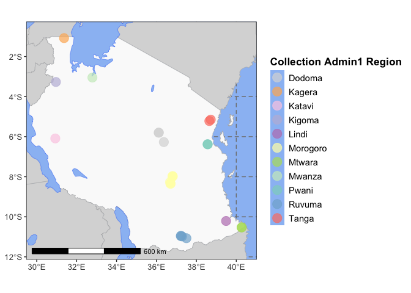
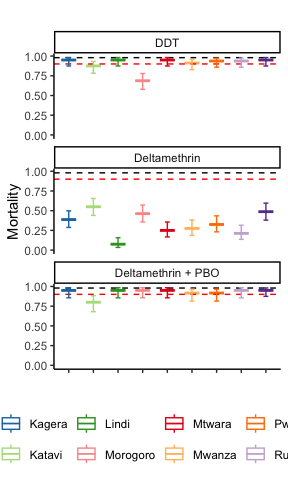
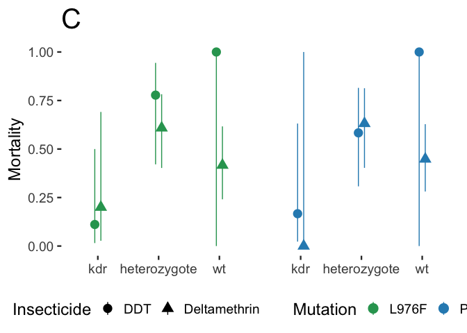
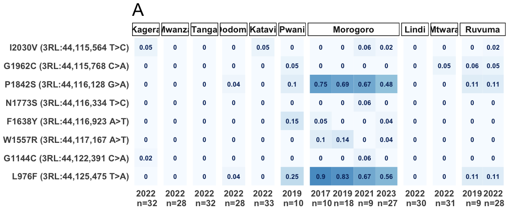
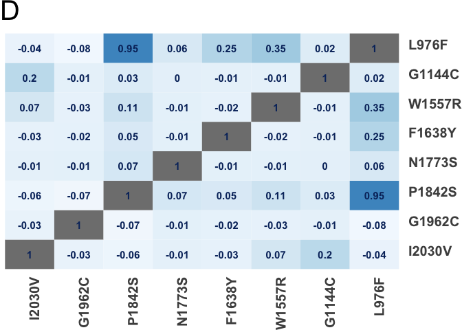

kdr_analysis
================
2024-07-29

## Kdr in funestus MS. Tristan Dennis and Joel Odero 2024.07.29.

Joel Odero performed the collections, bioassays and models. Tristan
Dennis wrote up this notebook for publication.

This markdown contains the code required to reproduce: 1. Map. 2.
Bioassay data. 2. Allele frequency by location and timepoint, LD heatmap
plots.

Let’s start by plotting the map. You will need to download the
rnaturalearth data to a directory of your choice.

    ## Reading layer `ne_10m_admin_1_states_provinces' from data source 
    ##   `/Users/dennistpw/Projects/cease/cease_wp1c/analysis_data/raster/ne_10m_admin_1_states_provinces/ne_10m_admin_1_states_provinces.shp' 
    ##   using driver `ESRI Shapefile'
    ## Simple feature collection with 4596 features and 121 fields
    ## Geometry type: MULTIPOLYGON
    ## Dimension:     XY
    ## Bounding box:  xmin: -180 ymin: -90 xmax: 180 ymax: 83.6341
    ## Geodetic CRS:  WGS 84

    ## Reading layer `ne_10m_admin_0_sovereignty' from data source 
    ##   `/Users/dennistpw/Projects/cease/cease_wp1c/analysis_data/raster/ne_10m_admin_0_sovereignty/ne_10m_admin_0_sovereignty.shp' 
    ##   using driver `ESRI Shapefile'
    ## Simple feature collection with 209 features and 168 fields
    ## Geometry type: MULTIPOLYGON
    ## Dimension:     XY
    ## Bounding box:  xmin: -180 ymin: -90 xmax: 180 ymax: 83.6341
    ## Geodetic CRS:  WGS 84

    ## Reading layer `ne_50m_lakes' from data source 
    ##   `/Users/dennistpw/Projects/cease/cease_wp1c/analysis_data/raster/ne_50m_lakes/ne_50m_lakes.shp' 
    ##   using driver `ESRI Shapefile'
    ## Simple feature collection with 412 features and 39 fields
    ## Geometry type: POLYGON
    ## Dimension:     XY
    ## Bounding box:  xmin: -165.8985 ymin: -50.62002 xmax: 176.0827 ymax: 81.94033
    ## Geodetic CRS:  WGS 84

    ## Reading layer `ne_50m_ocean' from data source 
    ##   `/Users/dennistpw/Projects/cease/cease_wp1c/analysis_data/raster/ne_50m_ocean/ne_50m_ocean.shp' 
    ##   using driver `ESRI Shapefile'
    ## Simple feature collection with 1 feature and 3 fields
    ## Geometry type: MULTIPOLYGON
    ## Dimension:     XY
    ## Bounding box:  xmin: -180 ymin: -85.19219 xmax: 180 ymax: 90
    ## Geodetic CRS:  WGS 84

<!-- -->

Now let’s plot insecticide resistance phenotype. Read in bioassay data,
model

    ## fixed-effect model matrix is rank deficient so dropping 11 columns / coefficients

    ## boundary (singular) fit: see help('isSingular')

<!-- -->

We can see that DDT is significantly associated with survivorship in
Morogoro region. Kagera has an interesting signal for DM+PBO too. Let’s
model and plot the data for the DDT bioassays.

Model 1: association of reduced mortality to DDT exposure with L976F vs
wt vs heterozygote

``` r
DDT<-read.csv("~/Projects/kdr_funestus_report_2023/tables/DDT_kdr.csv")
#models for plotting DDT
model976<-glm(Death~L967F, family=binomial, data=DDT)
model976_1<-glm(Death~1, family=binomial, data=DDT)
anova(model976_1, model976, test="Chisq")
```

    ## Analysis of Deviance Table
    ## 
    ## Model 1: Death ~ 1
    ## Model 2: Death ~ L967F
    ##   Resid. Df Resid. Dev Df Deviance Pr(>Chi)   
    ## 1        19     27.726                        
    ## 2        17     15.814  2   11.912  0.00259 **
    ## ---
    ## Signif. codes:  0 '***' 0.001 '**' 0.01 '*' 0.05 '.' 0.1 ' ' 1

``` r
summary(model976)
```

    ## 
    ## Call:
    ## glm(formula = Death ~ L967F, family = binomial, data = DDT)
    ## 
    ## Coefficients:
    ##              Estimate Std. Error z value Pr(>|z|)  
    ## (Intercept)    1.2528     0.8018   1.562   0.1182  
    ## L967Fkdr      -3.3322     1.3296  -2.506   0.0122 *
    ## L967Fwt       17.3133  4612.2021   0.004   0.9970  
    ## ---
    ## Signif. codes:  0 '***' 0.001 '**' 0.01 '*' 0.05 '.' 0.1 ' ' 1
    ## 
    ## (Dispersion parameter for binomial family taken to be 1)
    ## 
    ##     Null deviance: 27.726  on 19  degrees of freedom
    ## Residual deviance: 15.814  on 17  degrees of freedom
    ## AIC: 21.814
    ## 
    ## Number of Fisher Scoring iterations: 17

Model 2: association of reduced mortality to DDT exposure with P1842S vs
wt vs heterozygote.

``` r
model1842<-glm(Death~P1842S, family=binomial, data=DDT)
model1842_1<-glm(Death~1, family=binomial, data=DDT)
anova(model1842_1, model1842, test="Chisq")
```

    ## Analysis of Deviance Table
    ## 
    ## Model 1: Death ~ 1
    ## Model 2: Death ~ P1842S
    ##   Resid. Df Resid. Dev Df Deviance Pr(>Chi)  
    ## 1        19     27.726                       
    ## 2        17     21.707  2   6.0185  0.04933 *
    ## ---
    ## Signif. codes:  0 '***' 0.001 '**' 0.01 '*' 0.05 '.' 0.1 ' ' 1

``` r
summary(model1842)
```

    ## 
    ## Call:
    ## glm(formula = Death ~ P1842S, family = binomial, data = DDT)
    ## 
    ## Coefficients:
    ##              Estimate Std. Error z value Pr(>|z|)
    ## (Intercept)    0.3365     0.5855   0.575    0.566
    ## P1842Skdr     -1.9459     1.2421  -1.567    0.117
    ## P1842Swt      17.2296  2797.4420   0.006    0.995
    ## 
    ## (Dispersion parameter for binomial family taken to be 1)
    ## 
    ##     Null deviance: 27.726  on 19  degrees of freedom
    ## Residual deviance: 21.707  on 17  degrees of freedom
    ## AIC: 27.707
    ## 
    ## Number of Fisher Scoring iterations: 16

Now let’s do the same for DM

``` r
#Now Deltametrin
# Read the CSV file
Delta967 <- read.csv("~/Projects/kdr_funestus_report_2023/tables/Deltamethrin_967.csv")

model976Delta<-glm(Death~L967F, family=binomial, data=Delta967)
summary(model976Delta)
```

    ## 
    ## Call:
    ## glm(formula = Death ~ L967F, family = binomial, data = Delta967)
    ## 
    ## Coefficients:
    ##             Estimate Std. Error z value Pr(>|z|)
    ## (Intercept)   0.4418     0.4272   1.034    0.301
    ## L967Fkdr     -1.8281     1.1969  -1.527    0.127
    ## L967Fwt      -0.7783     0.5950  -1.308    0.191
    ## 
    ## (Dispersion parameter for binomial family taken to be 1)
    ## 
    ##     Null deviance: 72.010  on 51  degrees of freedom
    ## Residual deviance: 68.394  on 49  degrees of freedom
    ##   (52 observations deleted due to missingness)
    ## AIC: 74.394
    ## 
    ## Number of Fisher Scoring iterations: 4

Now let’s do the same for DM and 1842S

``` r
#Now Deltametrin
# Read the CSV file
Delta1842 <- read.csv("~/Projects/kdr_funestus_report_2023/tables/Deltamethrin_1842.csv")

model1842Delta<-glm(Death~P1842S, family=binomial, data=Delta1842)
summary(model1842Delta)
```

    ## 
    ## Call:
    ## glm(formula = Death ~ P1842S, family = binomial, data = Delta1842)
    ## 
    ## Coefficients:
    ##              Estimate Std. Error z value Pr(>|z|)
    ## (Intercept)    0.5390     0.4756   1.133    0.257
    ## P1842Skdr    -18.1051  1978.0902  -0.009    0.993
    ## P1842Swt      -0.7466     0.6047  -1.235    0.217
    ## 
    ## (Dispersion parameter for binomial family taken to be 1)
    ## 
    ##     Null deviance: 72.01  on 51  degrees of freedom
    ## Residual deviance: 64.90  on 49  degrees of freedom
    ##   (52 observations deleted due to missingness)
    ## AIC: 70.9
    ## 
    ## Number of Fisher Scoring iterations: 16

Now let’s combine our model predictions together and make a nice plot.

``` r
prediction976<- ggemmeans(model976, terms=c("L967F"))
prediction976$insec <- "DDT"
prediction1842<- ggemmeans(model1842, terms=c("P1842S"))
prediction1842$insec<- "DDT"

#dm data
prediction976Delta<- ggemmeans(model976Delta, terms=c("L967F"))
prediction976Delta$x<- factor(prediction976Delta$x, levels = c("kdr", "heterozygote", "wt"))
prediction976Delta$insec <- "Deltamethrin"

prediction1842Delta<- ggemmeans(model1842Delta, terms=c("P1842S"))
prediction1842Delta$x<- factor(prediction1842Delta$x, levels = c("kdr", "heterozygote", "wt"))
prediction1842Delta$insec <- "Deltamethrin"

#coerce to factor for plotting
prediction976Delta$x<- factor(prediction976Delta$x, levels = c("kdr", "heterozygote", "wt"))
prediction976$x<- factor(prediction976$x, levels = c("kdr", "heterozygote", "wt"))

#bind everything together
kdrdf<- rbind(prediction976, prediction976Delta) 
deltadf <- rbind(prediction1842, prediction1842Delta)
deltadf$x <- factor(deltadf$x, levels = c("kdr", "heterozygote", "wt"))

#bind dm and ddt data together
deltadf$Mutation <- 'P1842S'
kdrdf$Mutation <- 'L976F'
mutdf <- rbind(deltadf, kdrdf)

tplot <- ggplot(NULL, aes())+
  geom_pointrange(data =mutdf, aes(x=x,y=predicted, ymin=conf.low,ymax=conf.high, colour=Mutation, shape=insec),position = position_dodge(width=0.2), size=1)+
  #ggtitle("DDT") +
  xlab(bquote('P1842S')) +
  ylab(bquote('Mortality')) +
  ylim(0,1) +
  labs(colour='Mutation',)+
  scale_colour_manual(values=c("#2ca25f","#2b8cbe"))+
  theme_classic(base_family='Arial', base_size = 18)+
  facet_grid(cols=vars(Mutation))+
  theme(strip.text.x = element_blank(),
        plot.title = element_text(size=30),
        axis.title.x = element_blank(),
        legend.position = "bottom",
        axis.line = element_blank(),
        )+
  labs(shape="Insecticide")+
  ggtitle("C")

tplot
```

<!-- -->

Finally, let’s plot our allele frequency and our LD heatmaps.

``` r
df_samples %>% select(admin1_name, admin1_iso) %>% unique()
```

    ##     admin1_name admin1_iso
    ## 1         Pwani      TZ-19
    ## 11       Dodoma      TZ-03
    ## 15     Morogoro      TZ-16
    ## 24       Kigoma      TZ-08
    ## 25        Tanga      TZ-25
    ## 35       Ruvuma      TZ-21
    ## 55       Kagera      TZ-05
    ## 59       Mtwara      TZ-17
    ## 83       Katavi      TZ-28
    ## 113       Lindi      TZ-12
    ## 307      Mwanza      TZ-18

``` r
#mak eplotting df
df_freqs <- fread('~/Projects/kdr_funestus_report_2023/tables/kdr_vgsc_aa_freqs.csv')
df_freqs_2 <- pivot_longer(df_freqs, cols=4:17)
df_freqs_2$name <- gsub('frq_','',df_freqs_2$name)
loc_df <- df_samples %>% select(cohort_admin1_year, admin1_name, year) %>% unique()
df_freqs_2 <- left_join(df_freqs_2, loc_df, by=c('name' = 'cohort_admin1_year'))
df_freqs_2$label <- factor(df_freqs_2$label, levels = c('L976F (3RL:44,125,475 T>A)','G1144C (3RL:44,122,391 C>A)','W1557R (3RL:44,117,167 A>T)','F1638Y (3RL:44,116,923 A>T)','N1773S (3RL:44,116,334 T>C)','P1842S (3RL:44,116,128 G>A)','G1962C (3RL:44,115,768 C>A)','I2030V (3RL:44,115,564 T>C)'))
plotheatmap <- function(admin){
  #plot initial heatmap to get labs and legend
  ggplot(df_freqs_2[df_freqs_2$admin1_name == admin,], aes(y=label, x=as.factor(year), fill=value))+
    geom_tile(colour='white', linewidth=0)+
    scale_fill_gradientn(colours = c("#f7fbff", '#9ecae1','#4292c6'), breaks = c(0,0.5,1), limits = c(0,1))+
    geom_text(aes(label=round(value, digits = 2)), color = "#08306b", size = 4, fontface = "bold") +
    theme_classic()+
    facet_grid(~admin1_name)+
    theme(legend.position = "none",
          axis.title.x = element_blank(),
          axis.title.y = element_blank(),
          axis.ticks.x = element_blank(), 
          axis.ticks.y = element_blank(),
          axis.line = element_blank(),
          axis.text.x = element_text(size=15,face="bold"),
          axis.text.y=element_text(size=15,face="bold"),
          strip.text.x = element_text(size=15,face="bold"),
          panel.border = element_blank(),
          panel.grid.minor = element_blank(),
          panel.spacing = element_blank(),
          
          plot.margin = margin(r = 0.05, l = 0.05))
          #axis.text.y = element_blank())
}

listofheatmaps <- lapply(unique(df_freqs_2$admin1_name), plotheatmap)

#have had to wrangle this to get a multipanelled heatmap without faffing around in inkscape
library(patchwork)
heatmaplot <- 
listofheatmaps[[2]]+scale_x_discrete(labels = "2022\n n=32")+  ggtitle("A")+ theme(plot.title = element_text(size=30))+
listofheatmaps[[6]]+theme(axis.text.y = element_blank(), axis.title.y = element_blank())+scale_x_discrete(labels = "2022\n n=28")+
listofheatmaps[[9]]+theme(axis.text.y = element_blank(), axis.title.y = element_blank())+scale_x_discrete(labels = "2022\n n=32")+
listofheatmaps[[1]]+scale_x_discrete(labels = "2022\n n=28")+theme(axis.text.y = element_blank(), axis.title.y = element_blank())+
listofheatmaps[[10]]+theme(axis.text.y = element_blank(), axis.title.y = element_blank())+scale_x_discrete(labels = "2022\n n=33")+ 
listofheatmaps[[7]]+theme(axis.text.y = element_blank(), axis.title.y = element_blank())+scale_x_discrete(labels = "2019\n n=10")+
listofheatmaps[[4]]+theme(axis.text.y = element_blank(), axis.title.y = element_blank())+scale_x_discrete(labels = c("2017\n n=10","2019\n n=18","2021\n n=9","2023\n n=27"))+
listofheatmaps[[3]]+theme(axis.text.y = element_blank(), axis.title.y = element_blank())+scale_x_discrete(labels = "2022\n n=30")+
listofheatmaps[[5]]+theme(axis.text.y = element_blank(), axis.title.y = element_blank())+scale_x_discrete(labels = "2022\n n=31")+
listofheatmaps[[8]]+theme(axis.text.y = element_blank(), axis.title.y = element_blank())+scale_x_discrete(labels = c("2019\n n=9","2022\n n=28"))+
plot_layout(widths =  c(1.2,1.2,1.2,1.2,1.2,1.2,4,1.2,1.2,2))             

heatmaplot        
```

<!-- -->

REALLY finally, the LD plots:

``` r
#get matrix labels sorted
headerlabs <- rev(c('snp2','L976F','G1144C','W1557R','F1638Y','N1773S','P1842S','G1962C','I2030V'))
snp2labs <- rev(c('L976F','G1144C','W1557R','F1638Y','N1773S','P1842S','G1962C','I2030V'))
ldmat <- read.csv('~/Projects/kdr_funestus_report_2023/data/kdrld.csv', header = FALSE)
ldmat$snp2 <- snp2labs
colnames(ldmat) <- headerlabs
snp2labs
```

    ## [1] "I2030V" "G1962C" "P1842S" "N1773S" "F1638Y" "W1557R" "G1144C" "L976F"

``` r
#pivot to longfdorm df for plotting
lddf <- ldmat %>% pivot_longer(cols = 1:8)
lddf$snp2 <- factor(lddf$snp2, levels = snp2labs)
lddf$name <- factor(lddf$name, levels = snp2labs)

ldfig <- lddf %>% 
  ggplot(aes(x=name, y=snp2, fill=value))+
  geom_tile(colour='white', linewidth=0)+
  scale_fill_gradientn(colours = c("#f7fbff", '#9ecae1','#4292c6'), breaks = c(0,0.5,1), limits = c(-0.1,0.99))+
  geom_text(aes(label=round(value, digits = 2)), color = "#08306b", size = 4, fontface = "bold") +
  scale_y_discrete(position = "right")+
  theme_classic()+
  labs(fill = 'Rogers and Huff R')+
    theme(legend.position = "none",
          axis.title.x = element_blank(),
          axis.title.y = element_blank(),
          axis.ticks.x = element_blank(), 
          axis.ticks.y = element_blank(),
          plot.title = element_text(size=30),
          axis.line = element_blank(),
          strip.text.x = element_text(size=15,face="bold"),
          panel.border = element_blank(),
          panel.grid.minor = element_blank(),
          panel.spacing = element_blank(),
          plot.margin = margin(r = 0.1, l = 0.1),
          axis.text.x = element_text(size=15,face="bold",angle = 90,hjust=1),
          axis.text.y = element_text(size=15,face="bold",angle = 0, vjust = 0.1, hjust=1))+
  ggtitle("D")
ldfig
```

<!-- -->
